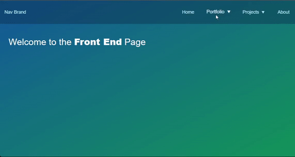

# Responsive Menu for React

This is a responsive menu for React applications, with the capability to include dropdown menus, the repo includes and example on using React Router 'react-router-dom' library to showcase the menu's functionality, however, the Menu component itself doesn't make use of the React Router library, it only provides the URL, based on the menu objects passed from the App.js component.


## Description

Downoload the Menu Folder which includes 2 files, menu.css and Menu.js. Or alternatively, download the whole repo, to examine usage within App.js that imports the Menu.
Menu.js is the component file, you can import this into your react component using import, for instance, in the current example hierarchy, I created a folder called Menu, in which I included the Menu.js and menu.css files, I'm importing using using `import Menu from './Menu/Menu'` inside App.js in order to import the Menu component.
Then you can use the Menu component in your App component:

`<Menu menuItems={menuItems} breakpoint={1024} right />`

## Props and control variables:

- ### Props passed to Menu component:

  - #### menuItems: Array of objects

    ```javascript
    const menuItems = [
      {
        name: "Home",
        href: "/",
        dropdown: false,
        id: "someId-or-just-use-nanoid",
      },
      {
        name: "Products",
        dropdown: true,
        id: "someId-or-just-use-nanoid",
        submenu: productsSubmenu,
      },
    ];
    ```

    As you can see in the example above, the first object in the array is a link to the home page, called 'Home', wich links to '/' path.
    The second object is a dropdown menu, you do not need to provide an href key, but a dropdown key with a value of true instead.
    also since the dropdown link is practically a nested menu, you need to pass a submenu object, which in turn is also an array of object.

    #### important:

    - All submenu items must be links, the Menu has 1 level of dropdown menus.
    - Objects `id` key is used as a react key in the `Menu` component when iterating using `map` higher order function. the value of `id` must follow react rules for providing `key` value.

    the products `submenu` can be provided within the `Products` object itself, but for readability, better to be provided as a separate array of objects, and passed later to the `submenu` key in the `Products` object. So the code above will become:

    ```javascript
    // Creating the submenu that will be passed to the Products object
    const productsSubmenu = {
        {name: "First Product",
        href: "/first-product",
        id: "someId"
        },
        {name: "Second Product",
        href: "/second-product",
        id: "someId"
        }
    }

    const menuItems = [
      {
        name: "Home",
        href: "/",
        dropdown: false,
        id: "someId-or-just-use-nanoid",
      },
      {
        name: "Products",
        dropdown: true,
        id: "someId-or-just-use-nanoid",
        submenu: productsSubmenu, // Passing the submenu to the Products object
      },
    ];
    ```

    Readme file in progress ...
